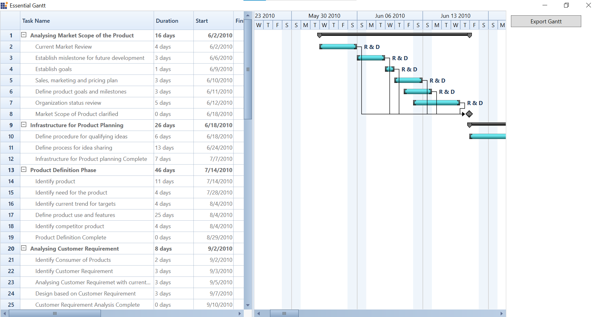

# How-to-export-the-Gantt-grid-and-chart-as-PDF-in-WPF-GanttControl
This article explains how to export the Syncfusion WPF Gantt chart and grid (combined) to the PDF.



This can be achieved by getting the Gantt grid and chart from the visual tree and arrange it in the canvas to convert the as bitmap and save as image. Please refer the following code snippet.

**Step 1:** Initialize the Gantt control, create a Model and ViewModel class then create a list of collections in the ViewModel class and add it into **ItemSource**.

[XAML]
```
<sync:GanttControl x:Name="Gantt"
                   ItemsSource="{Binding TaskCollection}"
                   ResourceCollection="{Binding ResourceCollection}">
```

**Step 2**: Get the Gantt grid from the visual tree and arrange it in the canvas and convert it to image as like in below code sample.

[C#]
```
…
this.layoutGrid.Children.Remove(this.ganttGrid);
Canvas innerCanvas = new Canvas();
innerCanvas.Children.Add(this.ganttGrid);
innerCanvas.Arrange(new Rect());
innerCanvas.UpdateLayout();
this.ganttGrid.Measure(new System.Windows.Size(double.PositiveInfinity, double.PositiveInfinity));
this.Gantt.Arrange(new Rect());
RenderTargetBitmap renderTargetBitmap = new RenderTargetBitmap(
    (int)this.ganttGrid.ActualWidth, (int)this.ganttGrid.ActualHeight, 96, 96, PixelFormats.Default);
renderTargetBitmap.Render(this.ganttGrid);
PngBitmapEncoder bitmapEncoder = new PngBitmapEncoder();
bitmapEncoder.Frames.Add(BitmapFrame.Create(renderTargetBitmap));
FileStream stream = new FileStream("grid.jpg", FileMode.OpenOrCreate, FileAccess.Write);
bitmapEncoder.Save(stream);
stream.Close();
innerCanvas.Children.Remove(this.ganttGrid);
this.layoutGrid.Children.Insert(0, this.ganttGrid);
…
```

**Step 3**: Same as convert the Gantt chart into image as like shown in the below code sample.

[C#]
```
…
this.Gantt.Measure(new System.Windows.Size(double.PositiveInfinity, double.PositiveInfinity));
this.Gantt.Arrange(new Rect());
RenderTargetBitmap bmp = new RenderTargetBitmap(
       (int)this.Gantt.ActualWidth, (int)this.Gantt.ActualHeight, 96, 96, PixelFormats.Default);
bmp.Render(this.chart);
int width = (int)(this.Gantt.DesiredSize.Width - this.chart.ActualWidth);
CroppedBitmap crpBmp = new CroppedBitmap(bmp, new Int32Rect(width, 0, (int)this.chart.DesiredSize.Width, (int)this.chart.ActualHeight));
bitmapEncoder = new PngBitmapEncoder();
bitmapEncoder.Frames.Add(BitmapFrame.Create(crpBmp));
stream = new FileStream("chart.jpg", FileMode.OpenOrCreate, FileAccess.Write);
bitmapEncoder.Save(stream);
stream.Close();
…
```

**Step 4**: Now convert the image saved stream into PDF as like shown in the below code sample.

[C#]
```
…
// Saving the images in Pdf.
PdfDocument doc = new PdfDocument
{
    PageSettings = new PdfPageSettings(new SizeF(frame2.PixelWidth, frame2.PixelHeight))
};
PdfPage page = doc.Pages.Add();
PdfGraphics graphics = page.Graphics;
if (saveFileDialog.ShowDialog() == true)
{
    using (Stream saveStream = saveFileDialog.OpenFile())
    {
        encoder.Save(saveStream);
        bitmapEncoder.Save(saveStream);
        saveStream.Seek(0, SeekOrigin.Begin);
        graphics.DrawImage(new PdfBitmap(saveStream), 0, 0);
        saveStream.Close();
    }
}

doc.Save(saveFileDialog.FileName);
doc.Close(true);
…

```

## See also

[How to add custom tooltip to Gantt](https://help.syncfusion.com/wpf/gantt/customtooltip)

[How to define your own schedule for Gantt to track the progress of projects](https://help.syncfusion.com/wpf/gantt/custom-schedule)

[How to differentiate the dates of holidays](https://help.syncfusion.com/wpf/gantt/holidays-customization)